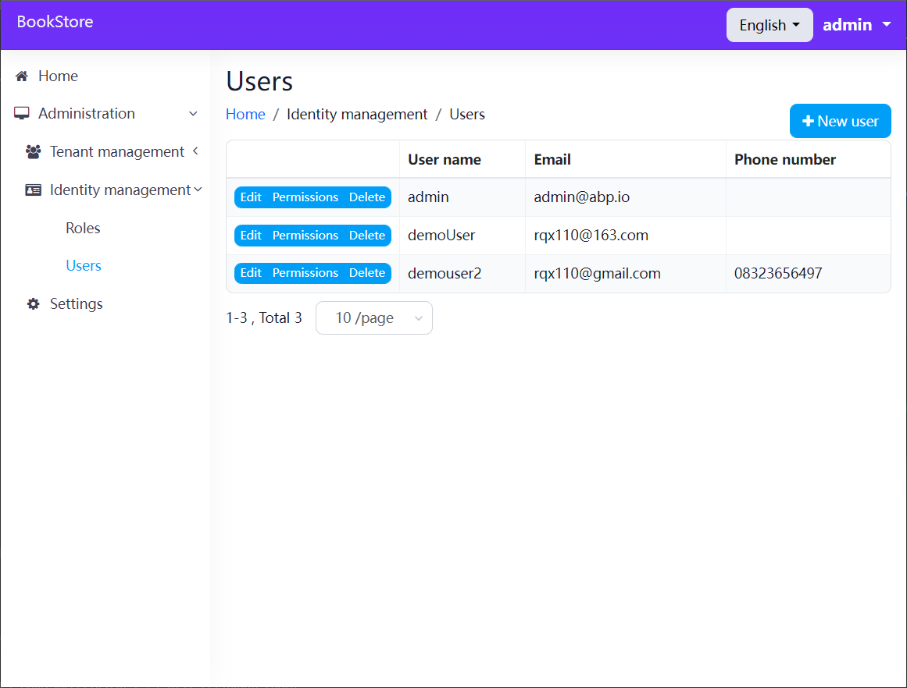
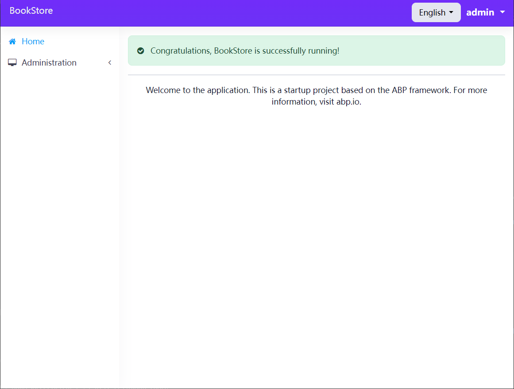

# Tk.Abp.BootstrapBlazorUI

**An Abp Blazor Theme based [BootstrapBlazor](https://www.blazor.zone/) !**

## Samples

Check the [samples](/samples/BookStore/)




## Quick Start

The first step is to use ABP CLI to create a new project.

`abp new BookStore -u blazor`

> See the [ABP official documentation](https://docs.abp.io) to learn [ABP framework](https://github.com/abpframework/abp).

**Open `BookStore.Blazor.csproj` and replace with the following:**

```csharp
<Project Sdk="Microsoft.NET.Sdk.BlazorWebAssembly">

  <Import Project="..\..\common.props" />

  <PropertyGroup>
    <TargetFramework>net6.0</TargetFramework>
    <BlazorWebAssemblyLoadAllGlobalizationData>true</BlazorWebAssemblyLoadAllGlobalizationData>
  </PropertyGroup>

  <ItemGroup>
    <PackageReference Include="Microsoft.AspNetCore.Components.WebAssembly" Version="6.0.0" />
    <PackageReference Include="Microsoft.AspNetCore.Components.WebAssembly.DevServer" Version="6.0.0" />
  </ItemGroup>

  <ItemGroup>
    <PackageReference Include="Volo.Abp.Autofac.WebAssembly" Version="5.1.4" />
  </ItemGroup>

  <ItemGroup>
    <PackageReference Include="Tk.Abp.IdentityManagement.Blazor.WebAssembly.BootstrapBlazorUI" Version="0.1.0" />
    <PackageReference Include="Tk.Abp.SettingManagement.Blazor.WebAssembly.BootstrapBlazorUI" Version="0.1.0" />
    <PackageReference Include="Tk.Abp.TenantManagement.Blazor.WebAssembly.BootstrapBlazorUI" Version="0.1.0" />
  </ItemGroup>

  <ItemGroup>
    <ProjectReference Include="..\..\src\BookStore.HttpApi.Client\BookStore.HttpApi.Client.csproj" />
  </ItemGroup>

</Project>

```

**Open `_Imports.razor` and add with the following:**

```csharp
@using BootstrapBlazor
@using Tk.Abp.BootstrapBlazorUI
@using Tk.Abp.BootstrapBlazorUI.Components
@using Tk.Abp.AspnetCore.Components.Web.BootstrapBlazorTheme.Layout
```

**Open `BookStoreBlazorModule` make the following changes:**

* Remove the `ConfigureBlazorise` method
* Fix wrong using namespace
* Update module dependencies
    * For example, replace `AbpIdentityBlazorWebAssemblyModule` with `AbpIdentityBlazorWebAssemblyBootstrapBlazorModule`

**Open `Index.razor` and replace with the following:**

```csharp
@page "/"
@inherits BookStoreComponentBase

<AbpPageHeader Title="Index"></AbpPageHeader>

<div class="page-content">
    <div style="text-align: center">
        
        <Alert Color="@Color.Success"
               Icon="fa fa-check-circle">
            Congratulations, BookStore is successfully running!
        </Alert>

        <Divider/>

    </div>
</div>

```

Run the `dotnet build` & `abp bundle` command in the `BookStore.Blazor` folder.



## Reference

[Lsw.Abp.AntDesignUI](https://github.com/realLiangshiwei/Lsw.Abp.AntDesignUI)
